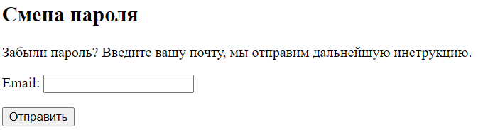
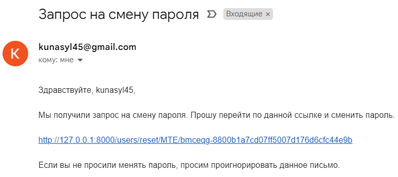
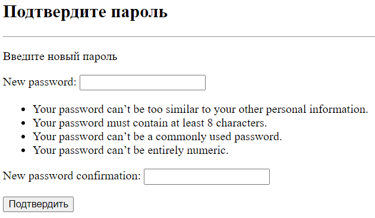

## AuthProject
**AuthProject** - приложение, в котором имеется функционал регистрации и авторизации.

### Структура:
Весь функционал прописан в папке `users/`
- `views.py` - вьюшки страниц регистрации, авторизации и главной страницы.
- `forms.py` - формы регистрации и авторизации
- `urls.py` - описана маршрутизация
- `forms.py` - формы для регистрации, авторизации и смены пароля
- `tokens.py` - генератор токена
- `decorators.py` - содержит декоратор `user_not_authenticated`
- `services.py` - содержит функции отправки сообщения на почту пользователя
- в папке `templates/` находятся html файлы
- в `static/users/` находится css файл

### Установка
Проект написан на django framework. В `requirements.txt` указаны нужные пакеты.

### Использование
Главная страница находится по адресу `/users`.
После регистрации (`users/register`) пользователь переходит на страницу авторизации (`users/login`),
а после попадает на главную страницу.

- регистрация с валидацией пароля

- авторизация

В случае когда пользователь забыл пароль, он может нажать на "Забыли пароль?".
После пользователь переходит на страницу `users/password_reset`.

На введенную почту приходит ссылка на смену пароля:

Перейдя по ссылке, пользователь вводит новый пароль.

После он переходит на страницу авторизации.