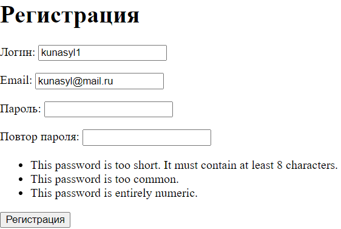
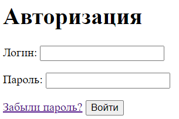

## AuthProject
**AuthProject** - приложение, в котором имеется функционал регистрации и авторизации.

### Структура:
Весь функционал прописан в папке `users/`
- views.py - вьюшки страниц регистрации, авторизации и главной страницы.
- forms.py - формы регистрации и авторизации
- urls.py - описана маршрутизация
- в папке `templates/` находятся html файлы

### Установка
Проект написан на django framework. В `requirements.txt` указаны нужные пакеты.

### Использование
Главная страница находится по адресу `/users`. После регистрации (`users/register`) пользователь переходит на страницу авторизации (`users/login`), а после попадает на главную страницу.

- регистрация с валидацией пароля

- авторизация

